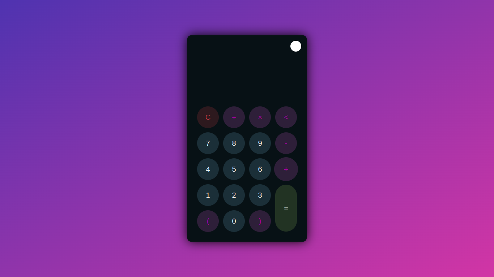
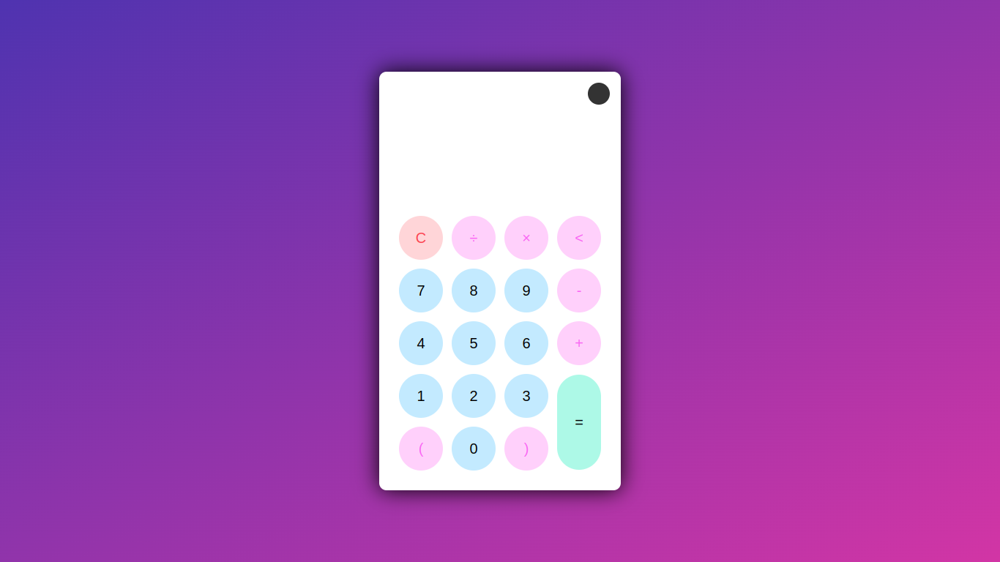

# Calculator.github.io
<h1 align="center">Hi 👋, I'm Shreyash Gaikwad</h1>
<h3 align="center">A passionate frontend developer from India</h3>
In this project I created Calculator with two themes. 
Dark

Light

<h3 align="left">Connect with me:</h3>

 
<a href="https://shreyash96og.github.io/Calculator.github.io/">click here to ue calculator<a>
